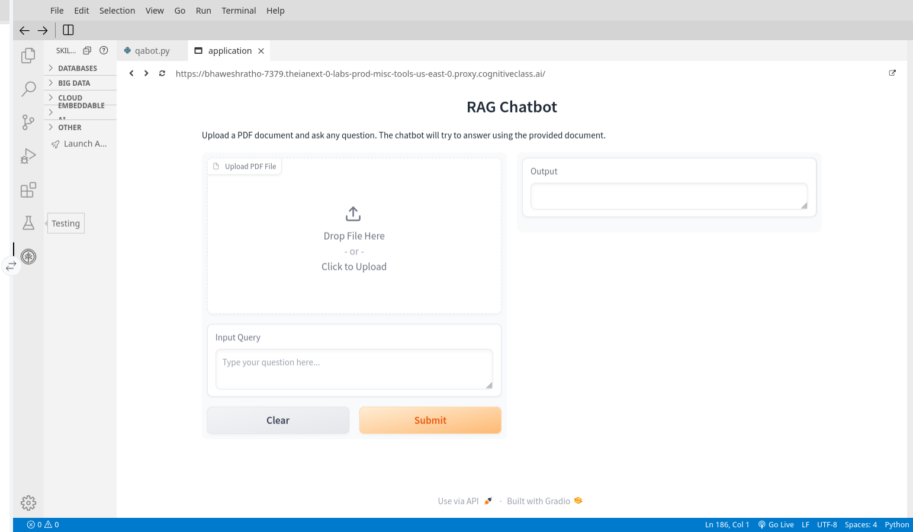
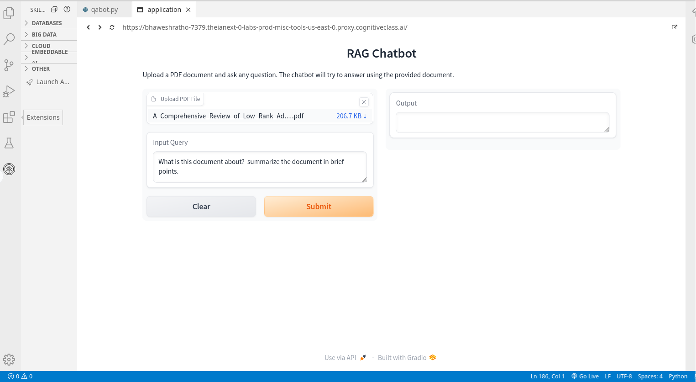
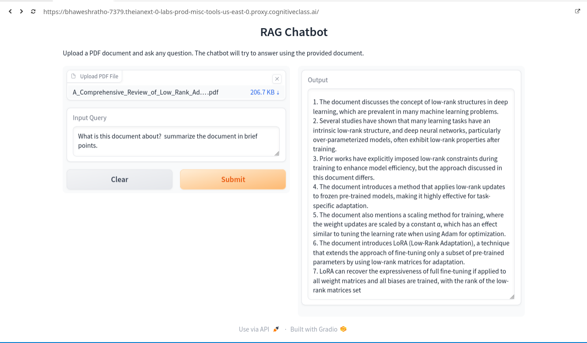

# 🤖 RAG Chatbot: IBM watsonx.ai + LangChain

A powerful Retrieval-Augmented Generation (RAG) conversational agent built using **IBM watsonx.ai**, **LangChain**, and **Gradio**. This application allows users to upload documents (PDF/Text) and interact with an AI that provides answers based specifically on the uploaded content.

---

## 📸 Project Walkthrough

Below is a visual guide of the QA Bot interface:

### 1. Agent UI
The main interface where the conversation takes place. Upload the Document


### 2. User Query
Ask specific questions related to the uploaded document.


### 3. Agent Answer
The system retrieves the relevant context from **ChromaDB** and generates a response using the **watsonx.ai** LLM.


---

## 🛠️ Technologies Used

This project leverages enterprise-grade AI tools and libraries:

* **LLM & Embeddings:** [IBM watsonx.ai](https://www.ibm.com/products/watsonx-ai) (via `ibm_watsonx_ai` & `langchain_ibm`)
* **Orchestration:** [LangChain](https://www.langchain.com/) (Chains, Memory, and Retrieval)
* **Vector Database:** [ChromaDB](https://www.trychroma.com/) (Local persistent storage)
* **UI Framework:** [Gradio](https://www.gradio.app/)
* **Document Processing:** `PyPDFLoader` & `RecursiveCharacterTextSplitter`

---

## 🧩 Architecture Logic

The bot follows a standard RAG pipeline:
1.  **Ingestion:** Files are loaded and split into chunks.
2.  **Embedding:** Chunks are converted into vectors using `WatsonxEmbeddings` or `HuggingFaceEmbeddings`.
3.  **Storage:** Vectors are stored in a `Chroma` vector store.
4.  **Retrieval:** When a query is asked, the most relevant chunks are retrieved.
5.  **Generation:** The `ConversationalRetrievalChain` passes the context and query to the Watsonx LLM to generate a factual answer.


---

## 🚀 Setup and Installation

### 1. Clone the Repository
```bash
git clone [https://github.com/your-username/your-repo-name.git](https://github.com/your-username/your-repo-name.git)
cd your-repo-name
```
### 2. Configure Environment
Create a virtual environment to keep your dependencies isolated and install the required packages:

```bash
# Create the virtual environment
python -m venv .venv

# Activate it
# On Windows:
.venv\Scripts\activate
# On macOS/Linux:
source .venv/bin/activate

# Install all necessary libraries
pip install ibm-watsonx-ai langchain-ibm langchain-community chromadb gradio pypdf wget
```

## 🔐 Step 3: Credentials & Configuration

To connect to **IBM watsonx.ai**, you need to provide your API Key and Project ID. 
```python
# 1. Setup Credentials
credentials = Credentials(
    url="[https://us-south.ml.cloud.ibm.com](https://us-south.ml.cloud.ibm.com)",
    api_key="YOUR_IBM_CLOUD_API_KEY"
)
# 2. Define Model Parameters
params = {
    GenParams.MAX_NEW_TOKENS: 500,
    GenParams.TEMPERATURE: 0.7,
}
# 3. Initialize WatsonxLLM
watson_llm = WatsonxLLM(
    model_id="ibm/granite-13b-chat-v2",
    credentials=credentials,
    project_id="YOUR_PROJECT_ID",
    params=params
)